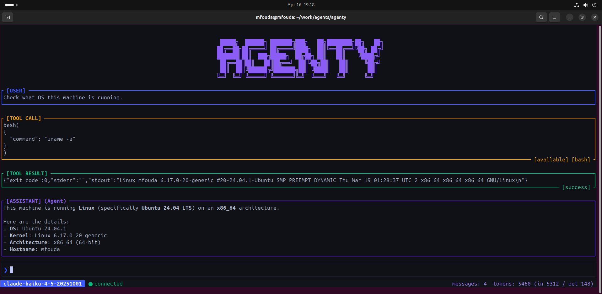
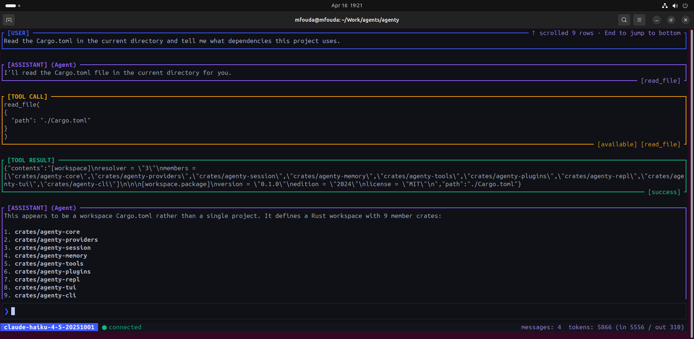
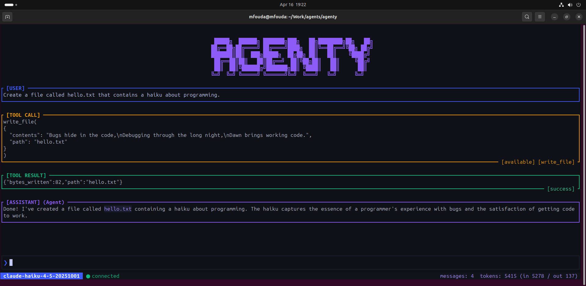
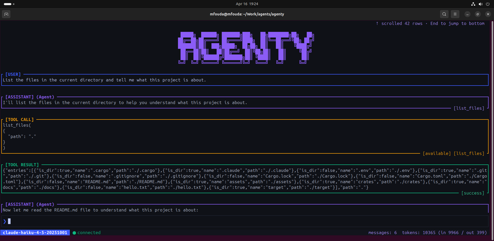
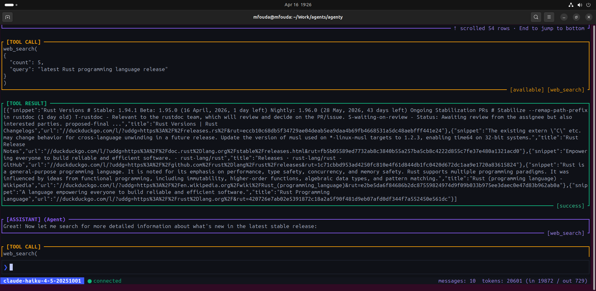
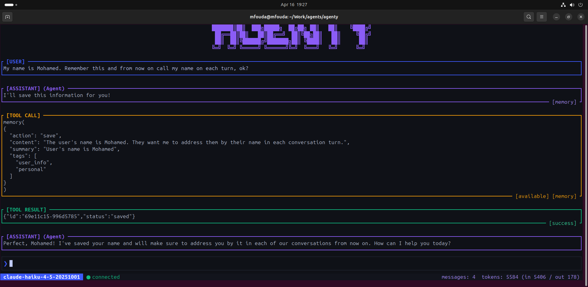

# Agenty


## CLI

Requires an API key for the provider you use. Set it in your shell environment, or drop a `.env` file in the directory you run `agenty` from:

```
ANTHROPIC_API_KEY=sk-ant-...
OPENAI_API_KEY=sk-...
GEMINI_API_KEY=...
```

```bash
# Interactive TUI (default provider: anthropic, default model: claude-sonnet-4-6)
cargo run

# One-shot headless prompt
cargo run -- -p "list the files in the current dir"

# Switch providers
cargo run -- --provider openai                  # uses gpt-4o-mini by default
cargo run -- --provider openai -m gpt-4o
cargo run -- --provider gemini                  # uses gemini-2.0-flash by default
cargo run -- --provider gemini -m gemini-1.5-pro

# Common flags
cargo run -- -m claude-haiku-4-5-20251001       # pick a model
cargo run -- --thinking 4096                    # enable extended thinking (Anthropic only)
cargo run -- -s "You are terse." -p "hello"     # system prompt
cargo run -- --max-tokens 2048
```

## Tools

| Feature | Description | Preview |
|---------|-------------|---------|
| **Bash** | Run shell commands and return stdout, stderr, and exit code |  |
| **Read File** | Read file contents from the local filesystem |  |
| **Write File** | Create or overwrite files on disk |  |
| **List Files** | List directory contents with file metadata |  |
| **Web Search** | Search the web via DuckDuckGo directly from the conversation |  |
| **Memory** | Persistent memory across conversations |  |

## Features

- **Multi-provider** -- Support multiple providers, e.g. Anthropic, OpenAI, and Gemini.
- **Sandboxed shell** -- on Linux, bash commands run inside a Landlock + network namespace sandbox with memory limits and a kill timeout. 
- **Persistent memory** -- the agent can save, search, and recall context across sessions. Stored as plain JSON files under `~/.agenty/memory/`.
- **Plugin system** -- provider your plugin on `~/.agenty/plugins/` and the agent will picks it up. 
- **Rate limiting** -- built-in request throttling with `--rpm`.
- **Session streaming** -- the TUI streams tokens, thinking blocks, and tool calls as they happen.

## Docs

The documentation site is built with [Astro Starlight](https://starlight.astro.build/). To run it locally:

```bash
cd docs
npm install
npm run dev
```

Then open http://localhost:4321 in your browser.
